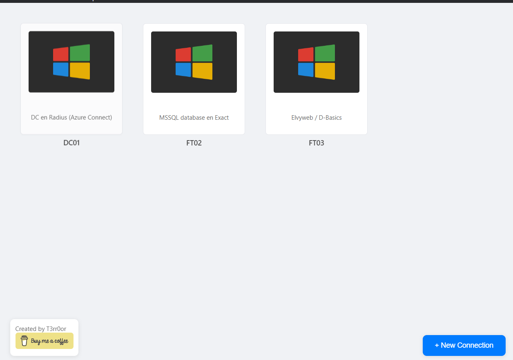

# RDP Manager

A modern, sleek Remote Desktop Connection manager built with Electron. Easily manage and connect to your remote desktop sessions with style.

## ✨ Features

- 🖥️ **Modern Interface** - Clean, intuitive design with monitor-style connection cards
- 🚀 **Quick Connect** - One-click connections with left-click
- ⚙️ **Easy Configuration** - Right-click to edit connection details
- 💾 **Auto-Save** - Connections are automatically saved locally
- 🔒 **Secure** - Uses native Windows RDP security
- 🎯 **Flexible** - Available as installer or portable version
- 🔄 **Auto Updates** - Always stay up to date with the latest features

## 📥 Download

Visit the [Releases](https://github.com/T3rr0or/RDP-Manager/releases/latest) page to download:

- **RDP.Manager.Setup.exe** - Standard installer (recommended)
- **RDP.Manager.exe** - Portable version, no installation needed

## 🎮 Quick Start

1. **Install:**
   - Run the installer or use the portable version
   - Launch RDP Manager

2. **Add Connection:**
   - Click "+ New Connection"
   - Enter a name and host
   - Add optional description
   - Save

3. **Connect:**
   - Left-click to connect
   - Right-click to edit
   - Delete unwanted connections

## 🔄 Updates

RDP Manager automatically checks for updates on startup. When a new version is available:
1. You'll be notified
2. Update will download automatically
3. Click to install when ready

## ❤️ Support

If you find RDP Manager useful, consider supporting its development:

## 📄 License

MIT © [T3rr0or](https://github.com/T3rr0or) 